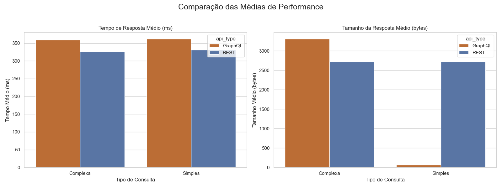
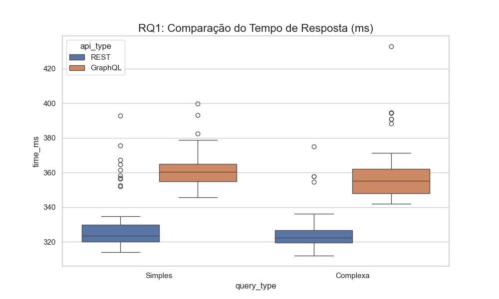
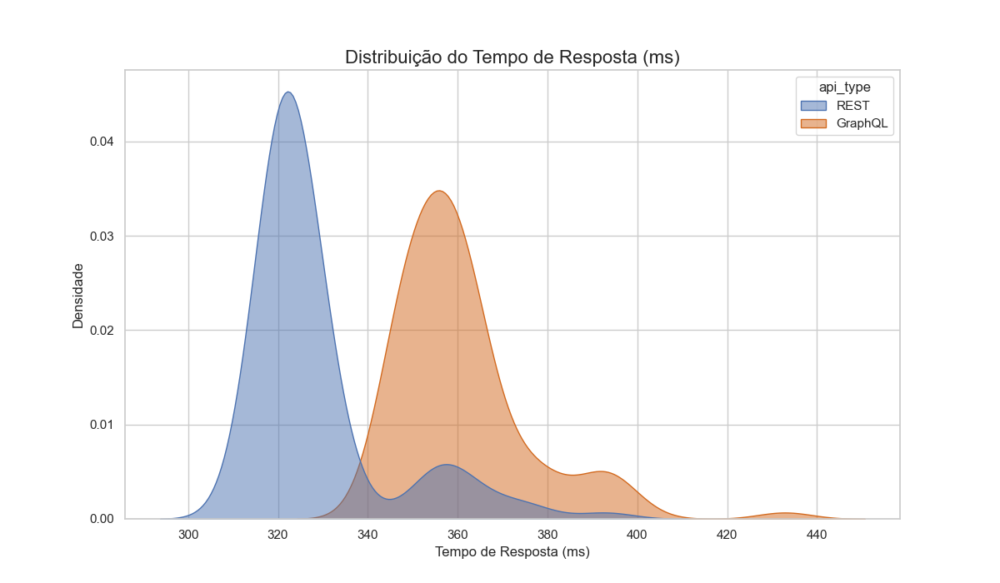
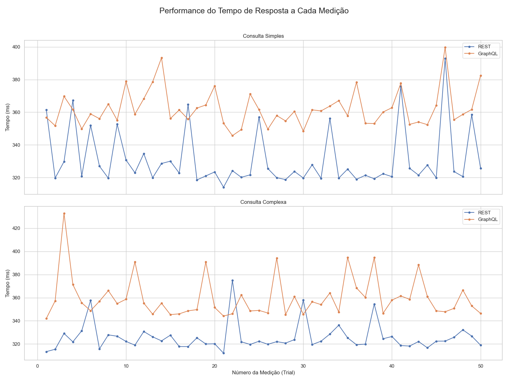
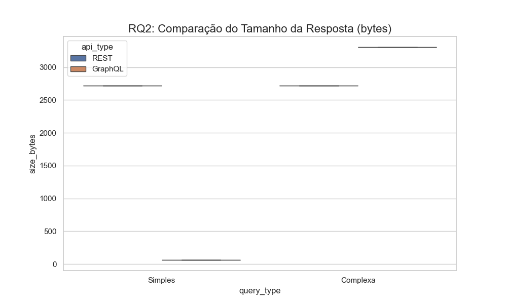

# Relatório Final

## 1. Introdução

A linguagem de consulta GraphQL representa uma alternativa moderna às tradicionais APIs REST. Proposta pelo Facebook, sua abordagem baseada em grafos permite que clientes solicitem exatamente os dados de que necessitam, evitando o over-fetching (excesso de dados) e o under-fetching (necessidade de múltiplas chamadas) comuns em REST. Apesar da crescente adoção do GraphQL, os benefícios quantitativos em cenários práticos nem sempre são claros.

Neste contexto, o objetivo deste estudo é realizar um **experimento controlado** para avaliar quantitativamente os benefícios da adoção de uma API GraphQL em detrimento de uma API REST. Especificamente, buscaremos responder às seguintes perguntas de pesquisa:

- **RQ1:** Respostas às consultas GraphQL são mais rápidas que respostas às consultas REST?
- **RQ2:** Respostas às consultas GraphQL têm tamanho menor que respostas às consultas REST?

## 2. Metodologia

Para responder às questões de pesquisa, realizamos um experimento controlado seguindo os passos de desenho, preparação, execução e análise.

### 2.1 Desenho do Experimento

O experimento foi estruturado com base nos seguintes elementos:

* **Hipóteses:**
    * **H1_0 (Tempo):** Não existe diferença estatisticamente significativa entre o tempo médio de resposta de uma consulta GraphQL e o de sua consulta REST equivalente.
    * **H2_0 (Tamanho):** Não existe diferença estatisticamente significativa entre o tamanho médio da resposta de uma consulta GraphQL e o de sua consulta REST equivalente.

* **Variáveis:**
    * **Independentes:** Tipo de API (REST, GraphQL) e Complexidade da Consulta (Simples, Complexa).
    * **Dependentes:** Tempo de Resposta (ms) e Tamanho da Resposta (bytes).

* **Objetos e Tratamentos:**
    * Utilizamos a API pública **"The Rick and Morty API"**, que oferece acesso aos mesmos dados via REST e GraphQL, como nosso objeto de estudo.
    * Definimos 4 tratamentos distintos baseados na combinação das variáveis independentes (T1: REST Simples, T2: GraphQL Simples, T3: REST Complexa, T4: GraphQL Complexa).

* **Ambiente e Execução:**
    * O experimento foi executado em um ambiente de desenvolvimento padrão, utilizando scripts Python com as bibliotecas `requests`, `pandas`, `matplotlib`, `seaborn` e `scipy`.
    * Realizamos **50 medições** para cada um dos 4 tratamentos, totalizando 200 pontos de dados. Para mitigar o efeito de flutuações de rede e caching, as requisições foram intercaladas e enviadas com headers `Cache-Control: no-cache`.

### 2.2 Análise de Dados

1. **Execução e Coleta:** Um script Python (`experimento.py`) realizou as 200 requisições aos endpoints da API, medindo o tempo de resposta e o tamanho do conteúdo de cada chamada e salvando os resultados em um arquivo `results.csv`.
2. **Análise e Validação:** Scripts de análise (`analise.py` e `analise_avancada.py`) processaram o arquivo `results.csv`. Foram geradas estatísticas descritivas, testes de hipótese (Teste T pareado) e múltiplas visualizações para interpretar os resultados sob diferentes perspectivas.

## 3. Resultados

A análise dos dados revelou diferenças claras entre as tecnologias. A tabela de estatísticas descritivas resume os achados numéricos:

| api_type  | query_type | time_ms (mean) | time_ms (median) | size_bytes (mean) |
| :---      | :---       | :---           | :---             | :---              |
| **GraphQL** | Complexa   | 359.87         | 355.26           | 3307.0            |
|           | Simples    | 362.17         | 360.33           | 63.0              |
| **REST** | Complexa   | 325.67         | 322.35           | 2719.0            |
|           | Simples    | 331.13         | 323.59           | 2719.0            |

### RQ1: Relação de Velocidade entre GraphQL e REST

A análise numérica e estatística (p-value = 0.000000) confirma que a API REST foi significativamente mais rápida neste experimento. Para aprofundar a análise, geramos as seguintes visualizações.

#### Análise Visual do Tempo de Resposta

##### Gráfico de Barras: Comparação Direta das Médias

**O que este gráfico mostra?** Uma comparação direta e clara do **tempo médio** de resposta.
**Conclusão:** Ele torna visualmente imediato que as barras do REST são mais baixas, confirmando que, em média, a API REST foi mais rápida para ambos os tipos de consulta.

##### Boxplot: Análise da Distribuição

**O que este gráfico mostra?** A distribuição completa dos dados: mediana (a linha no meio da caixa), o intervalo interquartil (a caixa em si), a dispersão geral (as "antenas") e os outliers (os pontos).
**Conclusão:** Além de confirmar que a mediana do REST é menor, ele mostra que os tempos de resposta do REST também foram mais **consistentes** (caixas menores), enquanto o GraphQL apresentou maior variabilidade.

##### Gráfico de Densidade: A Forma da Distribuição

**O que este gráfico mostra?** A "forma" da distribuição dos dados. A altura da curva indica onde a maioria das medições se concentrou.
**Conclusão:** Vemos dois "picos" claros. O pico do REST (azul) está mais à esquerda (tempos menores), e o pico do GraphQL (laranja) está mais à direita (tempos maiores), reforçando que a maioria das medições de cada API se agrupou em torno de suas respectivas médias.

##### Gráfico de Linha: Consistência Pareada

**O que este gráfico mostra?** A performance de REST e GraphQL lado a lado em cada uma das 50 medições. É a prova visual do nosso teste pareado.
**Conclusão:** Este é o gráfico mais poderoso para provar a consistência da diferença. Observe como a linha do GraphQL (laranja) está **sistematicamente acima** da linha do REST (azul) em quase todos os pontos. Isso demonstra que a vantagem de velocidade do REST não foi um acaso, mas um comportamento consistente ao longo de todo o experimento.

**Conclusão Final para RQ1:** Rejeitamos a hipótese nula (H1_0). Todas as análises (numérica, estatística e visual) confirmam que, neste experimento, a API REST apresentou menor latência de forma consistente e significativa.

### RQ2: Relação de Tamanho entre GraphQL e REST

A análise estatística (p-value = 0.000000) já provou que a diferença de tamanho é significativa. As visualizações a seguir tornam a magnitude dessa diferença inquestionável.

#### Análise Visual do Tamanho da Resposta

##### Gráfico de Barras: O Impacto da Diferença

**O que este gráfico mostra?** A comparação direta do tamanho médio.
**Conclusão:** A diferença é gritante. Para a consulta simples, a barra do GraphQL é quase invisível em comparação com a do REST, comunicando de forma imediata a enorme eficiência de dados do GraphQL ao evitar o *over-fetching*.

##### Boxplot: A Prova da Variância Zero

**O que este gráfico mostra?** Ele aparece como linhas retas porque, para cada tratamento, **todas as 50 medições tiveram o exato mesmo tamanho**. Não há variação.
**Conclusão:** A "estranheza" deste gráfico é, na verdade, sua maior força. Ele prova que a diferença de tamanho não é uma flutuação, mas um resultado **determinístico e constante**, reforçando a confiabilidade da conclusão.

**Conclusão Final para RQ2:** Rejeitamos a hipótese nula (H2_0). As análises confirmam que GraphQL oferece respostas com tamanho drasticamente menor, um resultado constante e significativo.

## 4. Discussão

Os resultados deste experimento fornecem uma visão sobre a performance de GraphQL e REST.

A superioridade do **REST em termos de velocidade** pode ser atribuída à natureza de seus endpoints. Um endpoint REST é, geralmente, uma operação pré-definida e otimizada no servidor. Em contrapartida, o servidor GraphQL precisa de uma etapa adicional para interpretar e resolver a consulta arbitrária enviada pelo cliente, o que pode introduzir uma pequena sobrecarga na latência.

Por outro lado, a vantagem do **GraphQL no tamanho dos dados** é inquestionável e representa seu maior benefício prático. A capacidade de solicitar apenas os campos necessários é crucial para aplicações sensíveis à banda, como em redes móveis. Além disso, a habilidade de agregar dados relacionados em uma única chamada simplifica a lógica do cliente e reduz drasticamente o número total de requisições, mitigando o problema N+1.

## 5. Conclusão Final

Este estudo comparou quantitativamente o desempenho de APIs GraphQL e REST através de um experimento controlado. Concluímos que:

1.  **Não há garantia de que GraphQL seja mais rápido.** No nosso cenário, a API REST apresentou tempos de resposta inferiores com significância estatística.
2.  **GraphQL é drasticamente mais eficiente no uso de dados.** Ele reduz significativamente o tamanho do payload ao evitar o over-fetching e pode diminuir a complexidade do cliente ao resolver consultas aninhadas em uma única chamada.

A escolha entre GraphQL e REST, portanto, não é uma questão de superioridade absoluta, mas de um **trade-off**. Para aplicações onde a eficiência de dados e a flexibilidade do cliente são primordiais, GraphQL é uma escolha poderosa. Para cenários onde a latência mínima em endpoints simples e fixos é o fator mais crítico, REST continua sendo uma solução robusta e performática.